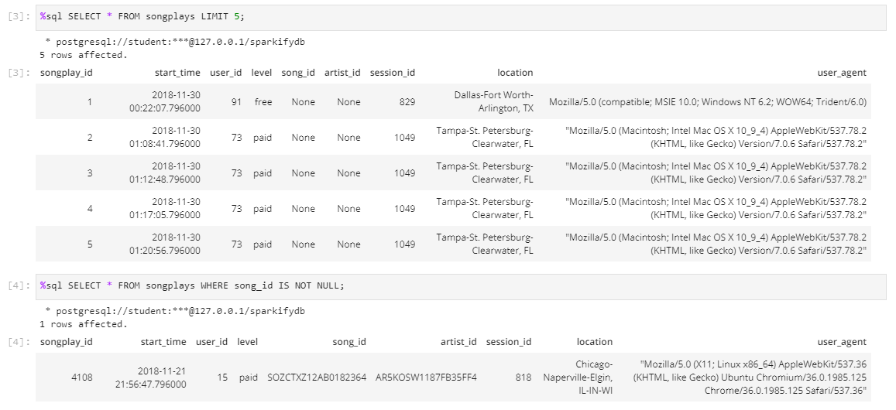

# Sparkify Data Modeling
This project addresses database schema and ETL pipeline for analyzing Sparkify's music streaming app usage. Data are provided from two directories: JSON user activity logs directory and JSON song metadata directory. 

The database will be created in PostgreSQL and designed to optimize queries on song play analysis. It is implemented with star schema with the song plays fact table and artists, songs, users, and time as dimension tables. 

ETL pipeline, written in Python and SQL, will transfer data from the JSON files into the database. 

## Files

- `data` folder contains the user activity log and the song JSON files.
- `README.md` file and `img` folder contains the README file and its images
- `create_tables.py` and `sql_queries.py` are the scripts to build the database schema
- `etl.py` is the ETL script from the files into the database
- `etl.ipynb` and `test.ipynb` are the notebooks to prepare ETL scripts and querying the loaded data

## How to Run
First, make sure you have prepared the python environment for these scripts to run. Other alternative is to use the docker environment. 
List of python modules used are available in `requirements.txt`.

Then create the database by running
```
python create_tables.py
```

Then run the ETL python script by running
```
python etl.py
```

The data should be loaded from the specified location into the database.

You can check the loaded data by running queries in `test.ipynb`. Make sure to restart the notebook after you finished to free the database connection

## Database Schema


The database schema consists of `songplays` table as the fact table with refers to `users`, `songs`, `artists`, and `time` table as the dimension tables.


## ETL Pipeline
First, songs and artist information are loaded from songs JSON files located on the specified directory using `process_song_file` function. 

Then, user activity logs are processed to get users and timestamp before getting song plays information using `process_log_file` function.

## Result
From the sample dataset the data shows each dimension tables are filled accordingly.


The `songplays` fact table is also filled but mostly or all of them has no song_id and artist_data due to small sample data set.

